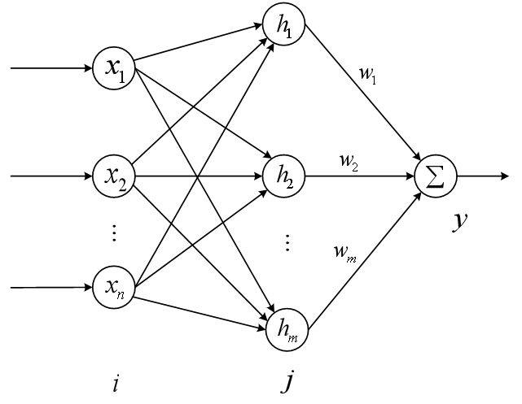

# Neural Network PID Controller

This is a neural network PID controller that can be used to control a system. The neural network is trained using a dataset of reference values and corresponding measured values. The neural network is then used to predict the reference value for a given measured value. The PID controller is then used to control the system based on the predicted reference value.

## This Example use RBF Neural Network to predict the reference value of PID controller.
now let me introduce you the RBF Neural Network.
- 多输入单输出RBF神经网络大体如下

- 其中参数如下

| 变量 | 含义 |
| :-----: | :------: | 
| x      | 输入  |
| h | 隐藏层神经元的输出  |
| w      | 隐藏层神经元的权重  |
| y     | 输出  |
- 最终输出：  
